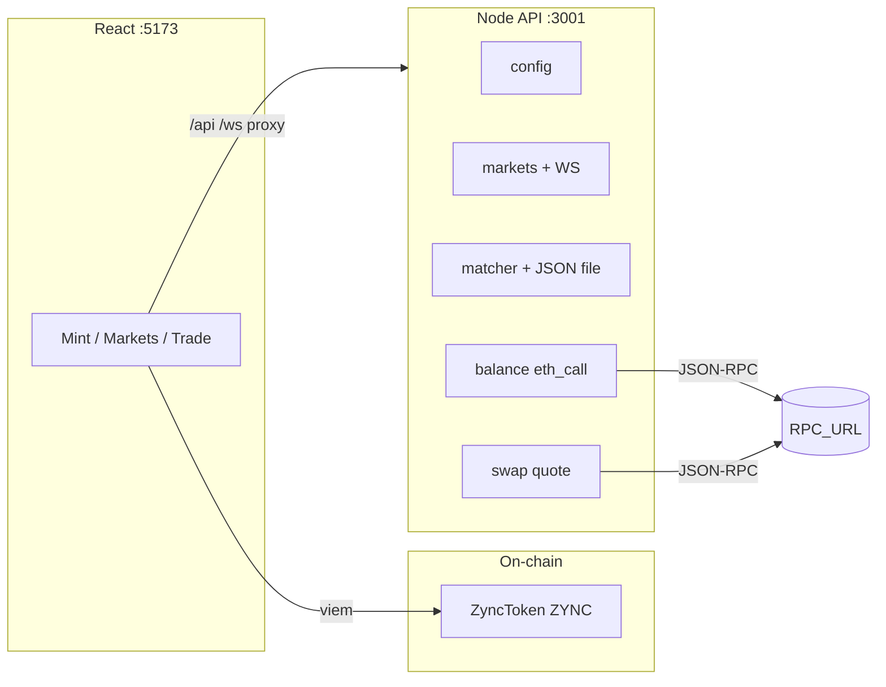

# ZYNC Token Stack

This repository is the **ZYNC utility token** slice: users acquire **ZYNC** (on-chain), and the app can gate premium usage or show trading-style UX backed by a **Node.js** API.

The goal is a credible, production-shaped layout — **Solidity** for the token, **Node (Express)** for config and product APIs, **React** for mint and demo markets.

---

## Project Structure

```
zync-erc20/
├── client/               # React + TypeScript + Vite frontend
│   ├── src/
│   │   ├── components/   # UI components (DEX layout, charts, panels)
│   │   ├── context/      # React contexts (config, markets stream, paper trade)
│   │   ├── pages/        # MintHomePage, MarketsPage, TradePage
│   │   ├── wallet/       # Wallet connect logic and catalog
│   │   └── abi/          # Contract ABI for viem
│   └── vite.config.ts
├── server/               # Node.js + Express + WebSocket API
│   ├── src/
│   │   ├── server.js         # Entry point, routes, WebSocket
│   │   ├── marketEngine.js   # Simulated perpetual markets
│   │   ├── matchingEngine.js # Order book + matching logic
│   │   ├── merge.js          # Book/trade merge helpers
│   │   ├── ethCall.js        # JSON-RPC eth_call helper
│   │   ├── zyncBalance.js    # ZYNC balance via RPC
│   │   └── swapQuote.js      # Uniswap V2-style swap quotes
│   └── data/                 # Persisted order state (auto-created)
├── contracts/            # Hardhat + Solidity smart contracts
│   ├── contracts/
│   │   └── ZyncToken.sol   # ERC-20 ZYNC token
│   ├── scripts/
│   │   └── deploy.js
│   ├── test/
│   │   └── ZyncToken.test.js
│   └── hardhat.config.cjs
├── package.json          # Root — single install, all scripts
├── .env                  # Environment variables (gitignored)
└── .env.example          # Template for .env
```

---

## Architecture



---

## Features

**Smart contract (`contracts/`)**
- Public mint against native ETH at `mintPriceWei` (18-decimal accounting)
- `MAX_SUPPLY` cap (1 billion ZYNC); owner `mintTo`, `setMintPrice`, `withdraw`
- OpenZeppelin ERC-20 + Ownable + ReentrancyGuard

**Backend API (`server/`)**
- **Markets**: simulated perpetuals-style overview, per-market detail (book, trades, candles), `WS /ws/markets` broadcast
- **Matching**: `POST /api/v1/orders` (limit/market), `GET /api/v1/orders`, `DELETE /api/v1/orders/:id`; state persisted to `server/data/matching_state.json`
- **ZYNC balance**: `GET /api/v1/wallets/:address/zync-balance` reads `balanceOf` via `eth_call`
- **Swap quotes**: `GET /api/v1/swap/quote` — Uniswap V2 Router02-compatible `getAmountsOut` + calldata builders

**Frontend (`client/`)**
- **Mint page**: buy ZYNC with ETH directly from the smart contract via viem
- **Markets page**: live overview with sparklines and 24h stats
- **Trade page**: TradingView-style chart, order book, trade tape, order entry panel
- **Wallet connect**: MetaMask, Coinbase, Trust, Phantom, Rainbow, and more
- **Paper trading**: simulated fills stored in `localStorage`

---

## Prerequisites

- **Node.js 18+** and npm

---

## Quick Start

### 1. Install dependencies

```bash
npm install
```

### 2. Configure environment

```bash
cp .env.example .env
```

### 3. Start the local blockchain

Open a terminal and keep it running:

```bash
npm run chain
```

### 4. Deploy the contract

In a second terminal, after the chain is running:

```bash
npm run deploy
```

Copy the printed `ZyncToken` address into `.env` as `ZYNC_TOKEN_ADDRESS`.

### 5. Start the app

In a third terminal — this starts the API server and frontend together:

```bash
npm run dev
```

| Service | URL |
|---------|-----|
| Frontend | http://localhost:5173 |
| API server | http://localhost:3001 |

> The `[server]` and `[client]` output is color-coded in the same terminal.

---

## Scripts Reference

| Command | Description |
|---------|-------------|
| `npm run chain` | Start local Hardhat blockchain (keep running) |
| `npm run deploy` | Deploy ZyncToken to localhost |
| `npm run compile` | Compile Solidity contracts |
| `npm run test:contracts` | Run contract tests |
| `npm run dev` | Start API server + frontend together (development) |
| `npm run server:dev` | Start API server only (with `--watch`) |
| `npm run client:dev` | Start frontend only (Vite dev server) |
| `npm run client:build` | Build frontend for production |
| `npm run start` | Start API server + frontend together (production preview) |

---

## HTTP API

| Method | Path | Purpose |
|--------|------|---------|
| `GET` | `/health` | Liveness check |
| `GET` | `/api/v1/config` | App/chain config for the UI |
| `GET` | `/api/v1/markets` | Markets overview |
| `GET` | `/api/v1/markets/:id` | Market detail (merged with matcher depth) |
| `GET` | `/ws/markets` | WebSocket: snapshot + tick envelopes |
| `POST` | `/api/v1/orders` | Submit order |
| `GET` | `/api/v1/orders` | List orders (`market_id`, `open_only`) |
| `DELETE` | `/api/v1/orders/:id` | Cancel order |
| `GET` | `/api/v1/wallets/:address/zync-balance` | ZYNC balance + optional `meets_minimum` |
| `GET` | `/api/v1/swap/quote` | Swap quote + calldata |

---

## Environment Variables

| Variable | Default | Description |
|----------|---------|-------------|
| `CHAIN_ID` | `31337` | Chain ID (must match `RPC_URL`) |
| `RPC_URL` | `http://127.0.0.1:8545` | JSON-RPC endpoint |
| `ZYNC_TOKEN_ADDRESS` | Hardhat default | Deployed token address |
| `PORT` | `3001` | API server port |
| `BIND_HOST` | `0.0.0.0` | API server bind host |
| `AURELEXA_PREMIUM_MIN_WEI` | — | Minimum ZYNC for premium gating |
| `MATCHING_DATA_PATH` | `server/data/matching_state.json` | Order state persistence path |
| `SWAP_ROUTER_ADDRESS` | — | Uniswap V2 Router02 address |
| `WETH_ADDRESS` | — | WETH address for swap routing |
| `SWAP_DEADLINE_SECS` | `600` | Swap deadline window |
| `MINT_PRICE_WEI` | `0.0001 ETH` | Initial mint price (deploy only) |

> **Note**: `CHAIN_ID` and `RPC_URL` must refer to the same network for correct balance reads and swap simulation.

---

## Do I Need to Run Contracts?

| Feature | Needs Contracts? |
|---------|-----------------|
| View demo markets | No |
| Paper trading | No |
| Live WebSocket ticks | No |
| Mint ZYNC tokens | Yes |
| Check real wallet balance | Yes |
| Swap quotes | Yes |
| Premium gating | Yes |

---

## Roadmap

- Wire the Trade panel to `POST /api/v1/orders`
- Server-side entitlement using balance or signed receipts
- Production deploy: real `CHAIN_ID`, RPC, token address, TLS
